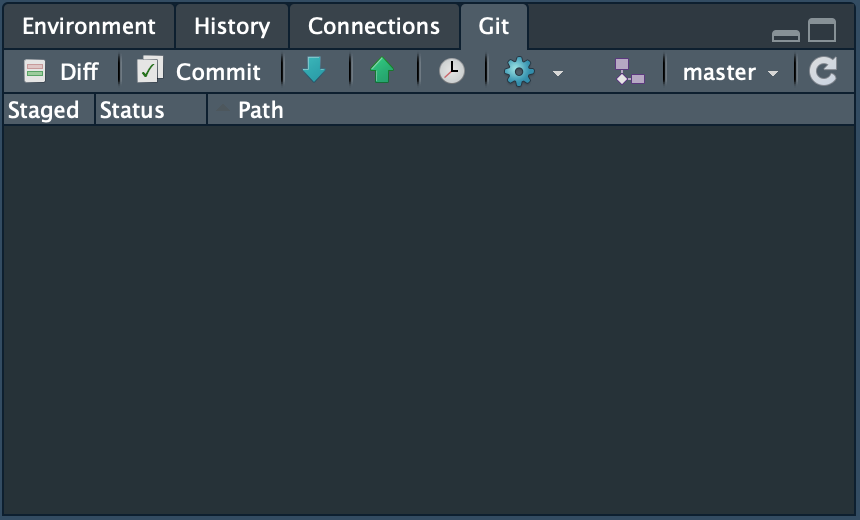

# STAT 432 Final Project

Here's a rough github for all of our stuff related to the final project

## Checking out this project

The simplest way to get this project into R is through the project manager built into R-studio

- First click the button above the files and copy the address of this directory.

- Then in the upper right hand corner of Rstudio, create a new project and paste the address into the first blank.

- Choose a directory where you want all of this content to be cloned and voila, everything should be there.

## Working on this project

Here's where almost all of your interactions with git will be done through

